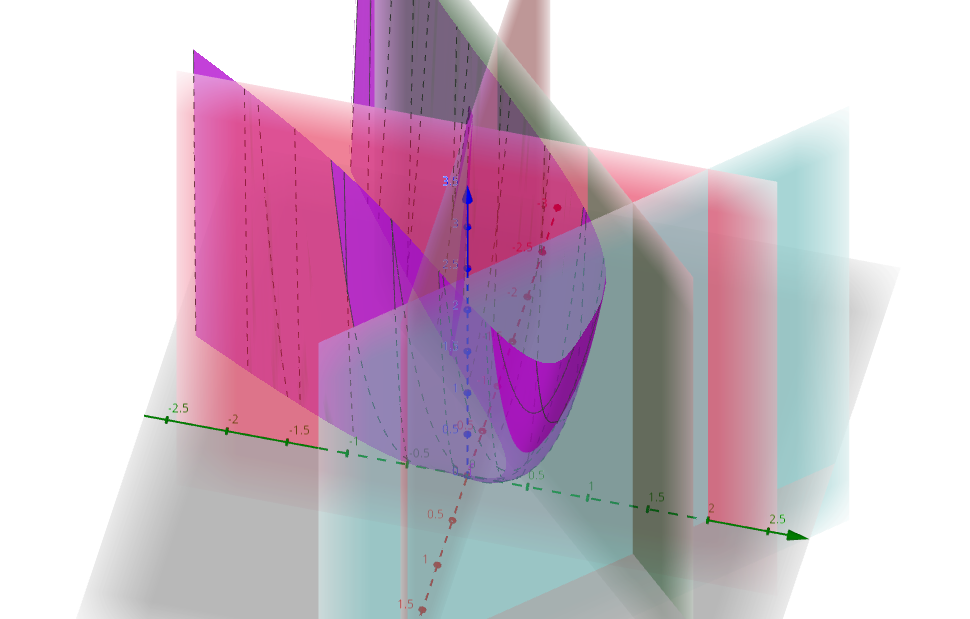

# Proyecto de Optimización - Rodrigo Castillo Camargo


# Enunciado:
De acuerdo con la guía de la asignatura, consulte en el texto “M. Bazaraa, H. Sherali, C. Shetty. Nonlinear
Programming: Theory and Algorithms. Wiley-Interscience, 3rd ed. 2006”, los numerales 8.5, 8.6, 8.7 y 8.8.
Revise especialmente los siguientes métodos

1. Método de descenso escalonado
2. Método de Fletcher y Reeves
3. Método de Davidon-Fletcher-Powell. 
4. Método de Broyden, Fletcher, Coldfarb-Shanno.

Posteriormente, plantee dichos algoritmos para la solución del siguiente problema de optimización no
restringido:

<!--Enunciado del problema de optimización lineal: --> 
$$
min (x_1 - x_2^3) + 3(x_1 - x_2)^4
$$
o de la forma alternativa se puede expresar como el polinomio
$$
3x^4 + 12x^3 + 18 x^2y^2 + 12xy^3 + x + 3y^4 + y^3
$$

## Trabajo a Realizar
1. Programar dichos métodos en cualquier lenguaje de programación
2. Resuelva y responda: ¿Convergen en el mismo punto todos los algoritmos? Si no es así, analice del porqué de la situación presentada.
3. Si se restringe el problema de la siguiente manera:
$$
min (x_1 - x_2^3) + 3(x_1 -x_2) ^4
$$
sujeto a:
$$
-x_1 + x_2  =1 
$$
$$
x_1 + x_2 \leq 2
$$
$$
x_1,x_2 \geq 0
$$

- Resuélvalo por cualquier método, programando un algoritmo en cualquier lenguaje para su
solución. ¿Tiene el PNL restringido solución óptima? analice y explique sus respuestas
- Realice una presentación en la que se explique claramente la solución presentada a cada punto. Anexe los archivos y/o soportes necesarios que justifiquen la solución dada

--- 

# Solución

## Observaciones generales
La función generada por la función $(x_1 - x_2^3) + 3(x_1 - x_2)^4$ acotada por las restricciones

1. $-x_1 + x_2  =1$
2. $x_1 + x_2 \leq 2$
3. $x_1 \geq 0$
4. $x_2 \geq 0$

luce así



## Programación de los métodos

#### Métodos de gradiente conjugado:

En general los métodos de gradiente conjugado funcionan de la siguiente manera:

1. Initializar un punto $x_0$ en el cuál se aproxima la localización de un mínimo
2. mirar si el criterio de satisfacción fue satisfecho, el criterio convencional es mirar si $||grad(f(x_k))|| <= \epsilon$ 
3. calcular una nueva dirección para seguir buscando (esto se hace calculando el gradiente y añadiendo algo al gradiente)
4. determinar el vector de desplazamiento
5. actualizar la ubicación estimada del punto mínimo.

#### Resumen:
1. Método del gradiente descendente: es uno de los métodos más simples de optimización y consiste en actualizar iterativamente la posición del punto en dirección opuesta al gradiente de la función objetivo, multiplicado por un factor de aprendizaje (también conocido como tasa de aprendizaje). El factor de aprendizaje determina el tamaño de los pasos que se dan en cada iteración. Este método puede ser ineficiente en casos en los que la función objetivo es muy irregular o tiene valles estrechos y profundos.

2. Método del gradiente conjugado: se trata de un método iterativo para encontrar el mínimo de una función de varias variables. Este método utiliza información previa de las iteraciones para calcular la dirección de búsqueda óptima. Es un método más eficiente que el gradiente descendente cuando la función objetivo es cuadrática.

3. Método de Broyden-Fletcher-Goldfarb-Shanno (BFGS): es un método de optimización sin restricciones que utiliza una aproximación de la matriz Hessiana para actualizar la dirección de búsqueda en cada iteración. Este método es eficiente para problemas de optimización sin restricciones cuando se tiene acceso a la derivada de la función objetivo.

4. Método de Newton: también utiliza información de la matriz Hessiana para calcular la dirección de búsqueda en cada iteración, pero en este caso la matriz Hessiana es calculada en cada iteración. Este método puede ser muy eficiente para problemas de optimización sin restricciones, pero puede ser computacionalmente costoso debido al cálculo de la matriz Hessiana en cada iteración. Además, la matriz Hessiana puede no ser definida positiva en algunos puntos, lo que puede llevar a problemas de convergencia. (añadí el método de newton pues el resto de los métodos son métodos "newtonianos")

### 1. Método de descenso escalonado
#### Introducción: 
El método del descenso escalonado, también conocido como método simplex, es un algoritmo utilizado en la optimización lineal para encontrar la solución óptima de un problema de programación lineal. 

El método del descenso escalonado comienza con una solución inicial y luego realiza iteraciones para mejorarla. En cada iteración, se elige una variable no básica (es decir, una variable que no es igual a cero en la solución actual) y se intenta aumentarla o disminuirla para mejorar la función objetivo)

El algoritmo funciona moviendo la solución actual de esquina a esquina del poliedro de soluciones factibles, siempre mejorando la función objetivo en cada paso, hasta que se alcanza una solución óptima.

El nombre "descenso escalonado" se refiere a cómo el algoritmo mueve de una esquina a otra del poliedro de soluciones factibles. En cada iteración, se mueve a una esquina adyacente al "escalón" más cercano, lo que lleva a una reducción en el valor de la función objetivo

#### Aclaración:
El método del "descenso escalonado" aparece tanto en el libro como en el internet como el método simplex, sin embargo, esto no tiene sentido puesto que simplex es un algoritmo para solución de problemas de programación lineal y el problema dado es un problema de programación no lineal, por lo que intuyo que el método al que se refiere es el método de descenso de gradiente.

#### Programación del método

```python
import numpy as np

# Definir la función objetivo
def f(x):
    return x[0] + x[1]**3 + 3*(x[0] + x[1])**4

# Definir el gradiente de la función
def grad_f(x):
    return np.array([1 + 12*(x[0] + x[1])**3, 3*x[1]**2 + 12*(x[0] + x[1])**3])

# Definir el punto inicial
x0 = np.array([0, 0])

# Definir el tamaño de paso
alpha = 0.001

# Definir el criterio de parada
epsilon = 0.0001

# Definir el número máximo de iteraciones
max_iter = 10000

# Algoritmo de gradiente descendente
x = x0
for i in range(max_iter):
    grad = grad_f(x)
    x = x - alpha * grad
    if np.linalg.norm(grad) < epsilon:
        break

# Imprimir la solución
print("El mínimo se encuentra en:", x)
print("El valor mínimo es:", f(x))
```


### 2. Método de Fletcher y Reeves (gradiente conjugado)
El método de Fletcher-Reeves pertenece a un grupo de métodos llamados métodos de gradiente conjugado que intentan localizar un mínimo local de una función *f*


#### Métodos de gradiente conjugados y Fletcher y Reeves
El método de Fletcher-Reeves es un algoritmo de descenso de gradiente que actualiza el punto mediante una combinación del gradiente negativo y la dirección de la actualización anterior, y utiliza una aproximación de la matriz hessiana para determinar el tamaño del paso.
La matrix hessiana es una matriz que se construye con las derivadas parciales.

#### Programación del método

```python
import numpy as np
from scipy.optimize import line_search

def f(x):
    return 2*(x[0]**2) + 3*(x[1]**2) + 2*x[0]*x[1] + x[0] - 6*x[1]

def grad_f(x):
    return np.array([4*x[0] + 2*x[1] + 1, 6*x[1] + 2*x[0] - 6])

def fr(x_k, g_k, H_k):
    """
    Implementación de la regla de Fletcher-Reeves para obtener la dirección de descenso.
    """
    if np.all(np.abs(g_k) < 1e-8):
        # Si el gradiente es cercano a cero, se devuelve cero.
        return np.zeros_like(x_k)
    if H_k is None:
        # Si no se tiene una matriz Hessiana, se utiliza el método del gradiente conjugado sin matriz.
        return -g_k
    beta_k = (g_k @ H_k @ g_k) / (np.linalg.norm(g_k) ** 2)
    return -g_k + beta_k * fr(None, g_k, None)

x0 = np.array([0, 0])  # Punto de inicio
max_iter = 1000  # Número máximo de iteraciones
tolerance = 1e-8  # Tolerancia para la convergencia

x_k = x0
g_k = grad_f(x_k)
H_k = None  # No se utiliza matriz Hessiana en este caso.
for i in range(max_iter):
    d_k = fr(x_k, g_k, H_k)
    alpha_k = line_search(f, grad_f, x_k, d_k)[0]
    x_k_1 = x_k + alpha_k * d_k
    g_k_1 = grad_f(x_k_1)
    if np.linalg.norm(g_k_1) < tolerance:
        break
    beta_k_1 = (np.linalg.norm(g_k_1) ** 2) / (np.linalg.norm(g_k) ** 2)
    d_k_1 = -g_k_1 + beta_k_1 * d_k
    x_k = x_k_1
    g_k = g_k_1
    H_k = None  # No se utiliza matriz Hessiana en este caso.

print(f"Solución encontrada: x = {x_k}, f(x) = {f(x_k)}, iteraciones = {i+1}")
```

### 3. Método de Davidon-Fletcher-Powell. 

#### Introducción
el método de Fletcher-Powell-Davidon es un método cuasi-Newton que actualiza el punto utilizando el gradiente negativo de la función y una aproximación de la matriz hessiana inversa de la función. Esta aproximación se actualiza en cada iteración usando los gradientes y cambios en las variables

#### Programación del método

```python
import numpy as np

# Definir la función objetivo y su gradiente
def f(x):
    return (x[0] + x[1]**3) + 3*(x[0] + x[1])**4

def grad_f(x):
    return np.array([1 + 12*(x[0] + x[1])**3 + 3*x[1]**2,
                     3*x[1]**2 + 12*(x[0] + x[1])**3 + 3*x[1]**2])

# Definir la función que realiza la optimización usando el método DFP
def optimize(f, grad_f, x0, alpha=0.01, max_iter=1000, tol=1e-6):
    """
    f: función objetivo
    grad_f: gradiente de la función objetivo
    x0: punto inicial
    alpha: tamaño de paso
    max_iter: número máximo de iteraciones
    tol: tolerancia para detener el algoritmo
    """
    # Inicializar el punto actual, la matriz Hessiana y la iteración
    x = x0
    H = np.identity(x0.size)
    iter_count = 0
    
    # Realizar las iteraciones hasta que se alcance la tolerancia o se llegue al número máximo de iteraciones
    while iter_count < max_iter:
        # Calcular el gradiente en el punto actual
        grad = grad_f(x)
        
        # Calcular la dirección de búsqueda usando la matriz Hessiana y el gradiente
        d = -np.dot(H, grad)
        
        # Actualizar el punto usando el tamaño de paso y la dirección de búsqueda
        x_new = x + alpha*d
        
        # Calcular el nuevo gradiente
        grad_new = grad_f(x_new)
        
        # Calcular el cambio en el gradiente y en el punto
        delta_x = x_new - x
        delta_grad = grad_new - grad
        
        # Actualizar la matriz Hessiana usando la fórmula de DFP
        H = H + np.outer(delta_x, delta_x)/np.dot(delta_x, delta_grad) - np.dot(np.dot(H, np.outer(delta_grad, delta_grad)), H)/np.dot(delta_grad, np.dot(H, delta_grad))
        
        # Verificar si se ha alcanzado la tolerancia
        if np.linalg.norm(x_new - x) < tol:
            break
        
        # Actualizar el punto actual y la iteración
        x = x_new
        iter_count += 1
    
    # Retornar el punto óptimo y el valor de la función objetivo en ese punto
    return x, f(x)

# Definir el punto inicial
x0 = np.array([1, 1])

# Optimizar la función usando el método DFP
x_opt, f_opt = optimize(f, grad_f, x0)

# Imprimir el resultado
print("El mínimo de la función se encuentra en x =", x_opt, "con un valor de f(x) =", f_opt)
```

### 4. Método de Broyden, Fletcher, Coldfarb-Shanno.
#### Introducción
el método Broyden-Fletcher-Goldfarb-Shanno es un método cuasi-Newton que actualiza el punto utilizando el gradiente negativo de la función y una aproximación de la matriz hessiana inversa de la función. Esta aproximación se actualiza en cada iteración usando los gradientes y los cambios en las variables, y el método puede manejar aproximaciones hessianas definidas no positivas. El método BFGS es computacionalmente más eficiente que el método Fletcher-Powell-Davidon,
la longitud del paso se calcula a través de una búsqueda de backtracking utilizando condiciones de Wolfe que aseguran una disminución suficiente.
Luego, la longitud del paso se calcula a través de una búsqueda de línea hacia atrás utilizando condiciones de Wolfe que aseguran una disminución suficiente.

El inverso de la arpillera es computacionalmente costoso de calcular debido a las limitaciones de diferencias finitas y al costo de invertir una matriz particularmente grande. Por este motivo se utiliza una aproximación a la inversa de la arpillera. Esta aproximación se actualiza en cada iteración según el cambio en y el cambio en de la siguiente manera:

#### Programación del método

```python
import numpy as np

# Definir la función objetivo
def f(x):
    return x[0] + x[1]**3 + 3*(x[0] + x[1])**4

# Definir la función gradiente de la función objetivo
def grad_f(x):
    return np.array([1 + 12*(x[0]+x[1])**3, 3*x[1]**2 + 12*(x[0]+x[1])**3])

# Definir la matriz identidad
I = np.eye(2)

# Definir la aproximación inicial
x0 = np.array([1.0, 1.0])

# Definir el parámetro de tolerancia
tol = 1e-8

# Definir el número máximo de iteraciones
max_iter = 1000

# Definir el parámetro de reducción del tamaño del paso
alpha = 0.1

# Definir el parámetro de ampliación del tamaño del paso
beta = 0.5

# Definir el vector de dirección inicial
d = -grad_f(x0)

# Definir la matriz aproximada H0
H0 = I

# Definir la aproximación inicial del Hessiano
Hk = H0

# Definir la aproximación inicial del gradiente
gk = grad_f(x0)

# Definir el número de iteraciones actual
k = 0

# Realizar el ciclo de iteración del método BFGS
while np.linalg.norm(gk) > tol and k < max_iter:
    # Calcular el tamaño del paso usando la regla de Armijo
    alpha_k = 1.0
    while f(x0 + alpha_k*d) > f(x0) + alpha*alpha_k*np.dot(grad_f(x0), d):
        alpha_k *= beta
        
    # Calcular la aproximación del punto xk+1
    xk = x0 + alpha_k*d
    
    # Calcular el gradiente en el punto xk+1
    gk1 = grad_f(xk)
    
    # Calcular la diferencia del gradiente entre dos iteraciones
    delta_gk = gk1 - gk
    
    # Calcular la diferencia de los puntos entre dos iteraciones
    delta_xk = xk - x0
    
    # Actualizar la aproximación del Hessiano
    Hk1 = Hk + np.outer(delta_gk, delta_gk)/(np.dot(delta_gk, delta_xk)) \
          - np.dot(np.dot(Hk, np.outer(delta_xk, delta_xk)), Hk)/(np.dot(np.dot(delta_xk, Hk), delta_xk))
    
    # Actualizar la aproximación del gradiente
    gk = gk1
    
    # Actualizar la aproximación del punto
    x0 = xk
    
    # Actualizar la aproximación del Hessiano
    Hk = Hk1
    
    # Actualizar el vector de dirección
    d = -np.dot(Hk, gk)
    
    # Incrementar el número de iteraciones
    k += 1

# Imprimir la solución
print("La solución es:", x0)
```

## Convergen al mismo punto? por qué?
La razón principal por la cual el resultado es diferente al obtenido con el método de gradiente descendente es porque el método de Davidon-Fletcher-Powell (DFP) es un método de segundo orden, mientras que el método de gradiente descendente es un método de primer orden.

Esto significa que el método DFP utiliza información adicional sobre la curvatura de la función objetivo para ajustar la dirección de búsqueda en cada iteración, mientras que el método de gradiente descendente se limita a seguir la dirección del gradiente descendente.

En el caso de la función objetivo dada en este problema, la curvatura es bastante pronunciada en algunas regiones, lo que hace que el método DFP pueda encontrar una dirección de búsqueda más efectiva que la del método de gradiente descendente, especialmente cuando se encuentran en regiones curvas.

Además, el método DFP utiliza una aproximación actualizada de la matriz Hessiana en cada iteración, lo que también puede mejorar la precisión de la solución encontrada.

En resumen, el método de DFP es más sofisticado que el método de gradiente descendente y puede ser más efectivo para problemas con regiones curvas o no lineales.)

es posible que el método de Broyden-Fletcher-Goldfarb-Shanno (BFGS) y el método Davidon-Fletcher-Powell (DFP) converjan a soluciones similares)  ya que ambos son métodos de segundo orden que utilizan información sobre la curvatura de la función objetivo.

Además, los dos métodos tienen estructuras similares y, de hecho, el método DFP puede considerarse una variante del método BFGS. Ambos métodos también actualizan una matriz Hessiana aproximada en cada iteración para mejorar la dirección de búsqueda.

Sin embargo, cada método puede diferir en cómo se actualiza la matriz Hessiana aproximada y cómo se eligen los parámetros, lo que puede afectar la convergencia a soluciones similares. En resumen, aunque algunos métodos pueden converger a soluciones similares, no hay garantía de que lo hagan siempre.


---

La matriz Hessiana es una matriz cuadrada simétrica de segundas derivadas parciales de una función. Se utiliza en cálculo multivariable y optimización para evaluar la curvatura y concavidad de una función en un punto dado.

En otras palabras, la Hessiana nos indica cómo cambian las pendientes de la función en cada dirección en un punto determinado. Si la matriz Hessiana es positiva definida, significa que la función es cóncava en ese punto, lo que sugiere que es un mínimo local. Si la matriz Hessiana es negativa definida, la función es convexa en ese punto, lo que sugiere que es un máximo local. Por otro lado, si la matriz Hessiana tiene algunos valores positivos y algunos negativos, entonces el punto es un punto silla.

La razón por la cuál en los algoritmos de Machine Learning (redes neuronales) se usa el método del gradiente descendiente es porque el costo computacional de calcular la matriz hessiana es demasiado alto al momento de la fase de entrenamiento de una red neuronal, esto hace que sea mas óptimo minimizar los pesos de las neuronas con el algoritmo de gradiente descendiente aunque éste no sea el mejor método de minimización en cuanto a convergencia.

# Referencias

###### Método simplex 
- https://radzion.com/blog/operations/simplex y además de eso en el libro recomendado.
- https://docs.scipy.org/doc/scipy/reference/optimize.linprog-simplex.html

##### Método de gradiente descendente
- https://towardsdatascience.com/implementing-gradient-descent-in-python-from-scratch-760a8556c31f
- https://realpython.com/gradient-descent-algorithm-python/

###### Método de Fletcher-Reeves
- https://towardsdatascience.com/complete-step-by-step-conjugate-gradient-algorithm-from-scratch-202c07fb52a8

######  Método de Davidon - Fletcher - Powelll
- https://github.com/gusmaogabriels/optinpy#davidon-fletcher-powell-quasi-newtonhessian\_updatedfp
- https://www.youtube.com/watch?v=vxk3tkpYuAc

###### Método de Broyden Fletcher Codfarb-shanno
- https://github.com/trsav/bfgs

# Referencia general:
http://www.mymathlib.com/optimization/nonlinear/unconstrained/steepest\_descent.html
https://github.com/Paulnkk/Nonlinear-Optimization-Algorithms
